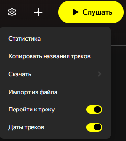

# Y-Music-Tools 🎵

Расширение для Яндекс Музыки (Firefox). Фокус на плейлисты.



## ✨ Основные возможности
- **Статистика**: треки, длительность, уникальные артисты, топ-10 артистов
- **Экспорт**: копировать список в буфер, скачать .txt, .csv
- **Импорт**: загрузка из файла (.txt, .csv, .m3u, .m3u8), треки ищутся в базе Я.Музыки
- **Добавление треков**: поиск по API и добавление в текущий плейлист; показывает, в каких ваших плейлистах выбранные треки уже есть
- **Даты треков**: дата добавления трека (или релиза, если нет данных)
- **Перейти к треку**: поиск в плейлисте с подсветкой совпадений (вкл/выкл в меню)

## ⚙️ Установка
1. Соберите: `python build.py` (нужен Python 3)
2. Откройте `about:debugging#/runtime/this-firefox`
3. «Загрузить временный дополнитель» → `Y-Music-Tools.zip` (или распакованная папка)

## 📦 Сборка
```bash
python build.py
```
